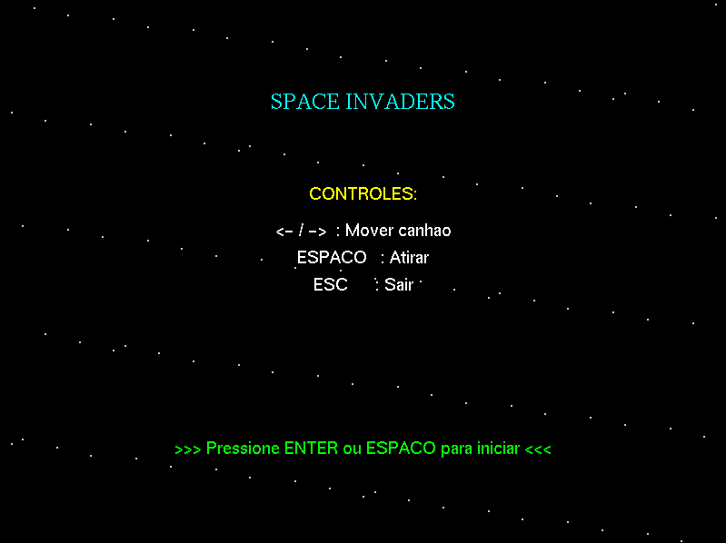
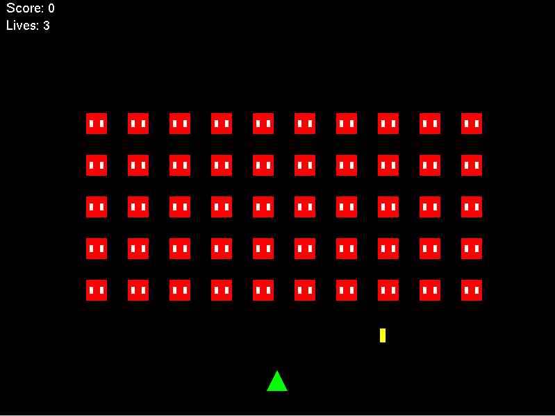
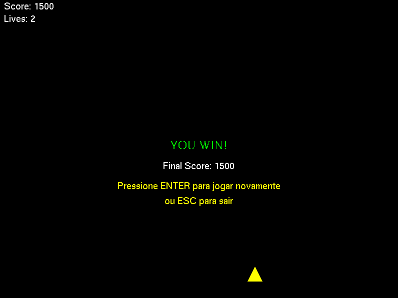
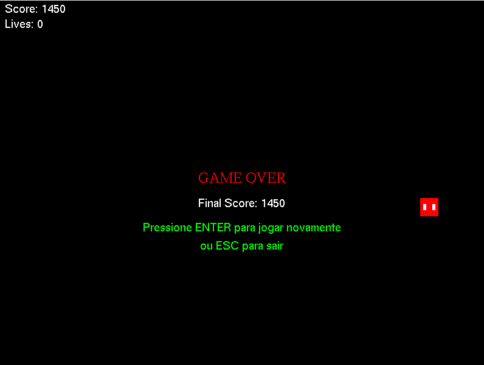

# Space Invaders 2D (OpenGL + GLUT + SDL2)

Um jogo 2D estilo Space Invaders desenvolvido em C++ utilizando OpenGL (pipeline fixo/legacy) para renderização, GLUT para janela/entrada de teclado e SDL2/SDL2_mixer para áudio.

Este projeto foi desenvolvido como trabalho prático de Computação Gráfica.

---

## 📸 Screenshots

Coloque suas imagens na pasta `fotos/` (crie-a na raiz do projeto). Exemplos de marcadores que você pode usar:

- Tela Inicial

  

- Gameplay

  

- Game Win

  

- Game Over

  

---

## 📋 Descrição

- Renderização 2D com OpenGL (gluOrtho2D) e GLUT.
- Loop de jogo com atualização ~60 FPS via timer GLUT.
- Entidades principais: `Player`, `Alien`, `AlienSwarm`, `Projectile` e gerência via `Game` (estado, HUD, colisões, input).
- Áudio com SDL2_mixer:
  - Menu: `assets/menu.mp3` (loop).
  - Jogo: `assets/music.mp3` (loop).
  - Efeitos: `assets/shoot.wav`, `assets/explosion.wav`.

---

## 🛠️ Tecnologias Utilizadas

- C++11
- OpenGL (legacy) + GLUT/freeglut
- SDL2 + SDL2_mixer
- g++ e make

---

## 📁 Estrutura do Projeto

```
CG3/
├── assets/                     # Áudios
│   ├── explosion.wav
│   ├── menu.mp3
│   ├── music.mp3
│   └── shoot.wav
├── fotos/                      # Screenshots
│   ├── tela_inicial.png
│   ├── gameplay.png
│   ├── game_win.png
│   └── game_over.png
├── include/                    # Headers
│   ├── Alien.h
│   ├── AlienSwarm.h
│   ├── Game.h
│   ├── GameObject.h
│   ├── Player.h
│   └── Projectile.h
├── src/                        # Implementações
│   ├── Alien.cpp
│   ├── AlienSwarm.cpp
│   ├── Game.cpp
│   ├── GameObject.cpp
│   ├── Player.cpp
│   ├── Projectile.cpp
│   └── main.cpp
├── bin/                        # Executável gerado
├── obj/                        # Objetos (.o)
├── makefile
├── TP3_OpenGL2D_CG_2025.pdf    # Enunciado
└── README.md                   # Este arquivo
```

---

## 🚀 Como Compilar e Executar

### Windows (MSYS2/MinGW64 recomendado)

1. Instale o MSYS2: https://www.msys2.org/
2. Abra o terminal "MSYS2 MinGW 64-bit".
3. Instale dependências:
   ```bash
   pacman -S --needed base-devel
   pacman -S --needed mingw-w64-x86_64-toolchain
   pacman -S --needed mingw-w64-x86_64-freeglut mingw-w64-x86_64-SDL2 mingw-w64-x86_64-SDL2_mixer
   ```
4. No arquivo `makefile`, comente a linha de LINUX e descomente a de WINDOWS:
   ```make
   # Para LINUX
   # LDFLAGS = -lGL -lglut -lGLU -lSDL2 -lSDL2_mixer

   # Para WINDOWS (usando MSYS2/MinGW)
   LDFLAGS = -lfreeglut -lopengl32 -lglu32 -lmingw32 -lSDL2main -lSDL2 -lSDL2_mixer
   ```
5. Compile na raiz do projeto:
   ```bash
   make
   ```
6. Execute:
   ```bash
   ./bin/space_invaders.exe
   ```

Observações Windows:
- Use sempre o terminal MinGW64 do MSYS2 para compilar e rodar.
- Garanta que o diretório de trabalho seja a raiz do projeto para que os áudios em `assets/` sejam encontrados.

### Linux (Debian/Ubuntu)

1. Instale dependências:
   ```bash
   sudo apt update
   sudo apt install -y build-essential freeglut3-dev libsdl2-dev libsdl2-mixer-dev
   ```
2. No `makefile`, deixe ativa a linha de LINUX (já é o padrão) e comente a de WINDOWS, se necessário.
3. Compile:
   ```bash
   make
   ```
4. Execute:
   ```bash
   ./bin/space_invaders
   ```

### Limpar build
```bash
make clean
```

---

## 🎮 Controles

- ENTER ou ESPAÇO (no menu): iniciar o jogo
- ← / →: mover o canhão
- ESPAÇO: atirar
- ESC: sair do jogo

O HUD exibe `Score` e `Lives`. Fim de jogo apresenta tela de `GAME OVER` ou `YOU WIN` com instruções para reiniciar.

---

## 🧩 Estados do Jogo

- MENU: Tela inicial com instruções.
- PLAYING: Jogo em execução.
- GAME_OVER: Derrota.
- WIN: Vitória.

**Transições**

- ENTER ou ESPAÇO no MENU: inicia (vai para PLAYING).
- ENTER em GAME_OVER/WIN: reinicia a partida.
- ESC: encerra o jogo.

## 📚 Objetivos/Conceitos de CG

- Pipeline fixo OpenGL: uso de glBegin/glEnd e matrizes ModelView/Projection.
- Projeção ortográfica 2D: gluOrtho2D(0, width, 0, height) definida em reshape.
- Desenho de primitivas: triângulos (Player), quadriláteros (Projectile), pontos (estrelas).
- Texto bitmap GLUT: HUD e mensagens com glutBitmapCharacter.
